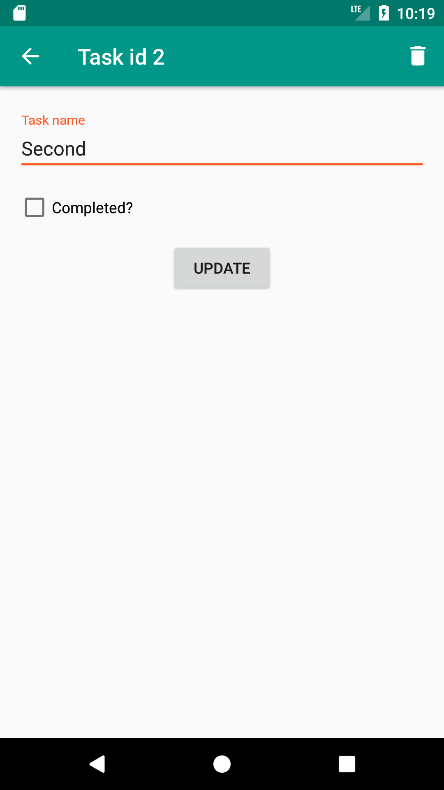

# CheckListRoom

A very simple example using Kotlin and Room (persistence library)[https://developer.android.com/topic/libraries/architecture/room.html].

## Requirements

This project is structured by using MVP Architecture (Model View Presenter) and some basic libraries + tools:
	- Room
	- RxJava 2.1.0
	- Butterknife (Kotlin implementation)
	- Anko
	- Basic support libraries like cardiew, design, recyclerview , etc. 
	- Rxbinding

## Showcase

## TODO

- [ ] Create Delete to completed CRUD